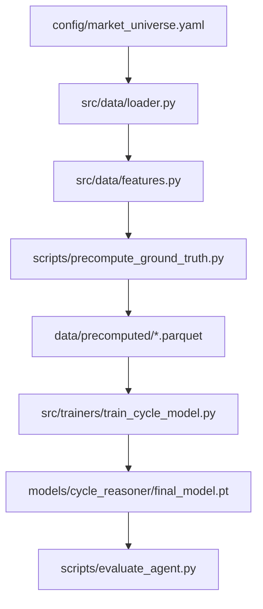

# System Architecture

## Overview

The active pipeline is:



## Data Layer

- `src/data/loader.py`: fetches OHLCV and report data
- `src/data/features.py`: technical trend features, Minervini-style template features, aligned fundamentals, and sequence-model compatibility features
- `scripts/precompute_ground_truth.py`: writes daily parquet tables with:
  - price and engineered features
  - oracle cycle ids
  - oracle `0/1/2/3` action labels
  - future return targets
  - hard-negative markers

## Oracle Layer

- `src/cycle/cycle_detector.py`: deterministic cycle detector
- `src/cycle/oracle.py`: turns cycles into daily action labels and decodes predicted actions back into cycle spans

## Model Layer

- `src/models/cycle_reasoning_model.py`: multi-scale causal 1D encoder with `21d / 63d / 252d` branches
- latent state feeds:
  - future-summary regression head
  - action head for `neutral / enter / hold_or_renew / exit`

## Training Layer

- `src/trainers/train_cycle_model.py`:
  - rebuilds oracle targets from parquet inputs for consistency
  - applies rolling walk-forward splits
  - optionally withholds a deterministic ticker subset
  - fits a feature standardizer on train only
  - trains with weighted action loss plus auxiliary future-target loss
  - writes checkpoint and JSON/Markdown reports

## Evaluation Layer

- `src/eval/cycle_prediction_metrics.py`:
  - action accuracy and macro F1
  - cycle precision / recall
  - profitable cycle rate
  - catastrophic cycle rate
  - bounded exit error
  - lead-time summaries
- `scripts/evaluate_agent.py`:
  - loads a checkpoint
  - evaluates selected splits
  - writes price-vs-cycle comparison plots

## Default Runtime Config

The active runtime config is `configs/cycle_model.yaml`.

Key defaults:

- oracle window: `21-252` trading days
- oracle minimum return: `+30%`
- action space: `0 neutral`, `1 enter`, `2 hold_or_renew`, `3 exit`
- cooldown after cycle end: `42` days
- rolling split: `3y train / 1y val / 1y test`
- model lookback: `252` days

## Cold Start

```bash
python scripts/precompute_ground_truth.py
python scripts/audit_precomputed_data.py
python src/trainers/train_cycle_model.py
python scripts/evaluate_agent.py
```
