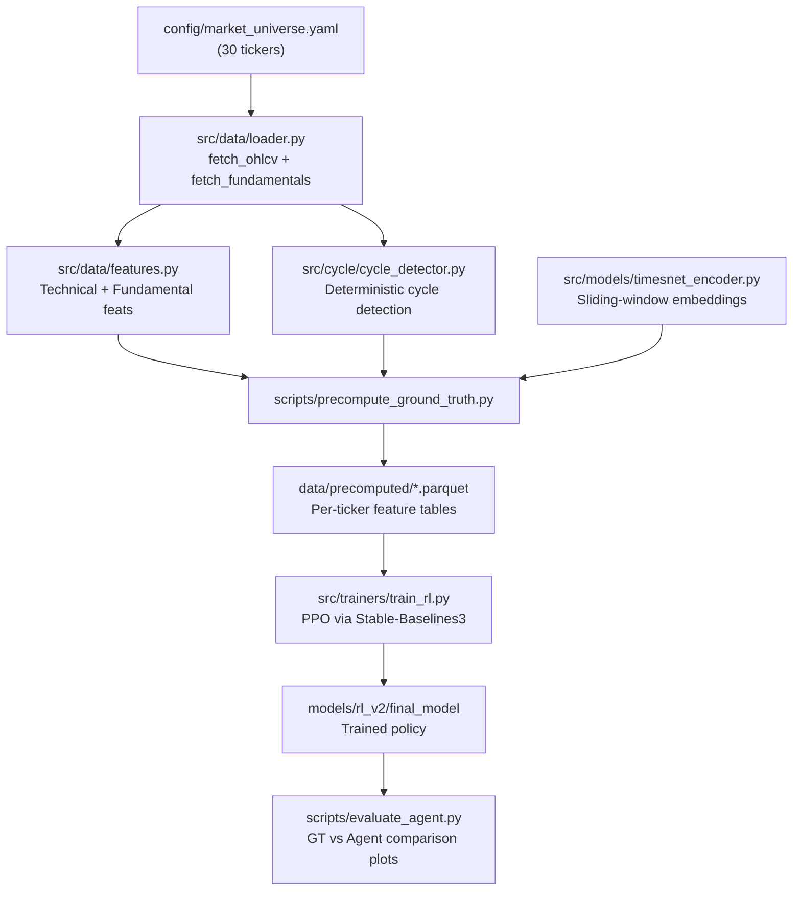

# Self-Supervised Cycle Trading — System Architecture

A comprehensive guide to the architecture, data flow, and module interactions of this reinforcement learning system for detecting price cycles confirmed by fundamental signals.

---

## 1. Design Philosophy

The system follows a **self-supervised learning** paradigm:

1. **Price cycles are detected deterministically** — no learned signals needed for ground truth
2. **An encoder learns latent representations** of raw OHLCV windows via TimesNet
3. **An RL agent learns to predict** whether the current day falls within a cycle, using embeddings + engineered features
4. **Rewards are based on classification accuracy** against cycle labels — *not* raw P&L

This design avoids overfitting to price momentum and instead trains the agent to recognize structural patterns that precede genuine business momentum.

---

## 2. High-Level Data Flow



---

## 3. Module-by-Module Breakdown

### 3.1 Data Layer (`src/data/`)

#### [loader.py](file:///c:/Users/rohil/Documents/RL%20Research%20Attempts/Taking_break/src/data/loader.py)

| Function | Purpose |
|----------|---------|
| `load_tickers_from_yaml(path)` | Parses `config/market_universe.yaml` → flat list of ticker strings |
| `fetch_ohlcv(ticker, start, end)` | Downloads OHLCV via `yfinance`, normalizes column names to lowercase, ensures UTC index |
| `fetch_fundamentals(ticker)` | Downloads earnings dates/EPS data via `yfinance.Ticker.earnings_dates` |
| `load_market_data(config, start, end)` | Orchestrator — returns `dict[ticker → {"price": df, "earnings": df}]` |

**Key details:**
- Handles yfinance ≥0.2.31 MultiIndex columns by flattening to lowercase
- Timezone-normalizes all DatetimeIndex to UTC
- Returns empty DataFrames on failure (no exceptions bubble up)

#### [features.py](file:///c:/Users/rohil/Documents/RL%20Research%20Attempts/Taking_break/src/data/features.py)

| Function | Features Computed |
|----------|-------------------|
| `compute_technical_features(df)` | 3/10/21-day momentum, 21-day realized vol, volume ratio, drawdown from 252-day peak, 10-day trend slope |
| `compute_fundamental_features_aligned(price_df, earnings_df)` | EPS surprise, YoY EPS growth, EPS acceleration — aligned via `merge_asof(direction='backward')` to prevent data leakage |

**Anti-leakage guarantee:** `merge_asof` with `direction='backward'` ensures each trading day only sees earnings reports published *before* that date.

#### [io_utils.py](file:///c:/Users/rohil/Documents/RL%20Research%20Attempts/Taking_break/src/data/io_utils.py)

Thin persistence layer with **parquet-preferred, pickle-fallback** strategy:
- `write_dataframe(df, path)` — tries `.to_parquet()`, falls back to `.to_pickle()`
- `read_dataframe(path)` — tries `.read_parquet()`, falls back to `.read_pickle()`

---

### 3.2 Cycle Detection (`src/cycle/`)

#### [cycle_detector.py](file:///c:/Users/rohil/Documents/RL%20Research%20Attempts/Taking_break/src/cycle/cycle_detector.py)

**Core algorithm**: Deterministic, brute-force search for price appreciation windows.

```
For each trading day t_start:
    For each duration in [min_duration, max_duration]:
        t_end = t_start + duration
        ret = price[t_end] / price[t_start] - 1

        IF ret >= min_return (default 30%):
            IF no intermediate price drops below 98% of start price:
                → Record as candidate cycle
                → Break (first valid duration per start)
```

**Parameters:**

| Parameter | Default | Meaning |
|-----------|---------|---------|
| `min_duration_days` | 40 | Minimum cycle length (trading days) |
| `max_duration_days` | 252 | Maximum cycle length (~1 year) |
| `min_return` | 0.30 | Minimum net appreciation (30%) |

**Overlap resolution**: Greedy — sort candidates by `(duration DESC, return DESC)`, accept non-overlapping cycles using a boolean occupancy array. Final output sorted chronologically.

**`Cycle` dataclass fields**: `start_date`, `end_date`, `start_idx`, `end_idx`, `duration_days`, `net_return`, `peak_date`, `peak_idx`

#### [cycle_metrics.py](file:///c:/Users/rohil/Documents/RL%20Research%20Attempts/Taking_break/src/cycle/cycle_metrics.py)

Latent-space trajectory analysis utilities (used for visualization/analysis, not training):

| Function | Purpose |
|----------|---------|
| `latent_velocity(Z)` | First-order differences of latent trajectory: `Z[1:] - Z[:-1]` |
| `cosine_similarity(a, b)` | Vectorized pairwise cosine similarity |
| `compute_cycle_score(Z, window)` | Rolling score combining directional coherence, persistence, and normalized energy |

---

### 3.3 TimesNet Encoder (`src/models/`)

#### [timesnet_blocks.py](file:///c:/Users/rohil/Documents/RL%20Research%20Attempts/Taking_break/src/models/timesnet_blocks.py) — `TimesNetBlock`

Implements the core TimesNet idea: **transform 1D time series into 2D representations** at dominant periodicities, apply 2D convolutions, then fuse back.

**Forward pass:**

```
Input: x (B, T, D)

1. FFT → freq_energy = |FFT(x)|.mean(dim=-1)
2. Top-k dominant frequencies selected
3. For each frequency k:
   a. Compute period = T / (freq_index + 1)
   b. Reshape: (B, T, D) → (B, T/period, period, D) → (B, D, T/period, period)
   c. Apply 2D Conv → GELU → 2D Conv
   d. Reshape back to (B, T, D)
4. Average all k outputs
5. Residual connection + LayerNorm + Dropout
```

**Design choices:**
- `top_k=3` by default (captures 3 dominant periodicities)
- Padding handles non-divisible sequence lengths
- Frequency indices are averaged across the batch to get a shared period length

#### [timesnet_encoder.py](file:///c:/Users/rohil/Documents/RL%20Research%20Attempts/Taking_break/src/models/timesnet_encoder.py) — `TimesNetEncoder`

```
Linear(in_dim → embed_dim) → [TimesNetBlock] × num_layers → LayerNorm
```

| Parameter | Default | Purpose |
|-----------|---------|---------|
| `in_dim` | 4 (OHLC) / 5 (OHLCV) | Input feature dimension |
| `embed_dim` | 64 / 128 | Latent dimension |
| `num_layers` | 2 | Depth of TimesNet stack |
| `top_k` | 3 | FFT frequencies per block |

**Input**: `(B, T, D)` — batch of time windows
**Output**: `(B, T, embed_dim)` — per-timestep embeddings (mean-pooled to single vector in precompute script)

#### [heads.py](file:///c:/Users/rohil/Documents/RL%20Research%20Attempts/Taking_break/src/models/heads.py)

Two simple linear projection heads (for self-supervised pretraining tasks):

| Head | Purpose |
|------|---------|
| `MaskedReconstructionHead` | Projects embeddings back to original OHLCV space (masked autoencoding) |
| `FutureLatentHead` | Projects embeddings to predict next-step latent (contrastive/predictive) |

---

### 3.4 RL Environment (`src/envs/`)

#### [cycle_trade_env.py](file:///c:/Users/rohil/Documents/RL%20Research%20Attempts/Taking_break/src/envs/cycle_trade_env.py) — `TimeSteppedCycleEnv`

A `gymnasium.Env` where **each step = one trading day**.

**Observation Space** (Dict):

| Key | Shape | Source |
|-----|-------|--------|
| `embedding` | `(128,)` | TimesNet latent vector (columns `emb_*`) |
| `tech_features` | `(N,)` | Technical indicators (columns `tech_*`) |
| `fund_features` | `(3,)` | Fundamental features (columns `fund_*`) |

**Action Space**: `Discrete(2)` — `0 = Out of Cycle`, `1 = In Cycle`

**Reward Structure:**

| Scenario | Reward |
|----------|--------|
| Correctly predict **In Cycle** | `+1.0 + consecutive_days × 0.01` |
| Correctly predict **Out of Cycle** | `+0.1` |
| False Positive (predict In, actually Out) | `-0.5` |
| False Negative (predict Out, actually In) | `-1.0` |

The **duration bonus** (`consecutive_correct_in × 0.01`) rewards sustained correct identification of cycle interiors, encouraging the agent to learn cycle persistence rather than just entry/exit points.

**Episode**: Steps through the entire DataFrame sequentially. Terminates when reaching the last row.

---

### 3.5 Training Pipeline (`src/trainers/`)

#### [train_rl.py](file:///c:/Users/rohil/Documents/RL%20Research%20Attempts/Taking_break/src/trainers/train_rl.py)

**Pipeline:**

```
configs/rl.yaml → load_all_precomputed_data(glob) → TimeSteppedCycleEnv → DummyVecEnv → PPO → Save
```

| Step | Detail |
|------|--------|
| 1. Load config | `configs/rl.yaml` — hyperparams, data paths |
| 2. Load data | Glob all `data/precomputed/*.parquet`, concatenate, drop NaN |
| 3. Create env | `DummyVecEnv` wrapping `TimeSteppedCycleEnv` |
| 4. Init PPO | `MultiInputPolicy` (handles Dict obs), LR=3e-4, γ=0.99 |
| 5. Train | 200K timesteps default |
| 6. Save | `models/rl_v2/final_model` |

**PPO hyperparameters** (from `configs/rl.yaml`):

| Parameter | Value |
|-----------|-------|
| `learning_rate` | 3e-4 |
| `n_steps` | 2048 |
| `batch_size` | 128 |
| `gamma` | 0.99 |
| `total_timesteps` | 200,000 |

---

### 3.6 Precompute Script (`scripts/`)

#### [precompute_ground_truth.py](file:///c:/Users/rohil/Documents/RL%20Research%20Attempts/Taking_break/scripts/precompute_ground_truth.py)

The **data preparation pipeline** that transforms raw market data into training-ready feature tables.

**Per-ticker pipeline:**

```
1. fetch OHLCV + earnings via loader
2. compute_technical_features(price_df)
3. compute_fundamental_features_aligned(price_df, earnings_df)
4. detect_cycles(close) → binary in_cycle column
5. Sliding-window TimesNet encoding:
   - Window = 96 trading days
   - Per-column z-score normalization
   - Mean-pool encoder output → 128-dim vector per day
6. Join embeddings with feature table
7. Save to data/precomputed/{TICKER}.parquet
```

**Output columns**: `open, high, low, close, volume, tech_*, fund_*, in_cycle, emb_0..emb_127, ticker`

---

### 3.7 Evaluation (`scripts/` + `src/eval/`)

#### [evaluate_agent.py](file:///c:/Users/rohil/Documents/RL%20Research%20Attempts/Taking_break/scripts/evaluate_agent.py)

Loads trained PPO model, runs it through each ticker's data, produces:
- **Side-by-side comparison plots** (Ground Truth vs Agent predictions)
- **Per-ticker accuracy** logged to console

#### [metrics.py](file:///c:/Users/rohil/Documents/RL%20Research%20Attempts/Taking_break/src/eval/metrics.py)

| Function | Output |
|----------|--------|
| `compute_classification_metrics()` | Precision, Recall, F1, AUC |
| `compute_calibration_metrics()` | Brier score, calibration curve data |
| `compute_stability_metric()` | Rolling centroid drift (embedding consistency) |
| `compute_coverage()` | Fraction of timesteps flagged as in-cycle |
| `plot_calibration()` | Reliability diagram (PNG) |
| `plot_metrics_summary()` | Bar chart of key metrics (PNG) |

---

### 3.8 Visualization (`src/visualization/`)

| Module | Function | Output |
|--------|----------|--------|
| `price_cycle_plot.py` | `plot_price_and_cycles()` | Price chart with green-shaded detected cycles |
| `latent_trajectory.py` | `plot_latent_trajectory()` | PCA-reduced 2D scatter of latent embeddings colored by time |

---

## 4. Configuration Reference

### `config/market_universe.yaml`

Defines the stock universe: 30 tickers across 10 industry groups (Software, Semiconductors, Biotech, Medical Devices, Internet, Consumer Electronics, Renewables, Aerospace, FinTech).

### `configs/rl.yaml`

```yaml
env:
  embedding_size: 128
  reward_params:
    correct_in: 1.0      # TP reward
    correct_out: 0.1     # TN reward
    false_pos: -0.5      # FP penalty
    false_neg: -1.0      # FN penalty (asymmetric — missing cycles is worse)
    duration_bonus: 0.01  # Per-day bonus for sustained correct In-Cycle

training:
  total_timesteps: 200000
  learning_rate: 0.0003
  n_steps: 2048
  batch_size: 128
  gamma: 0.99

data:
  precomputed_dir: "data/precomputed/*.parquet"
```

---

## 5. End-to-End Workflow

```bash
# 1. Install dependencies
pip install -r requirements.txt

# 2. Explore cycles (optional — visualization)
python main.py

# 3. Precompute features + embeddings + cycle labels
python scripts/precompute_ground_truth.py

# 4. Train PPO agent
python src/trainers/train_rl.py

# 5. Evaluate agent vs ground truth
python scripts/evaluate_agent.py
```

---

## 6. Testing

| Test File | What it Tests | Status |
|-----------|---------------|--------|
| `tests/test_rl_training_smoke.py` | Short PPO training run (1K steps) — verifies no crashes | ✅ Active |
| `tests/test_env_reward_queue.py` | Archived — tests old `CycleTradeEnv` API | ⏭️ Skipped |

Run all tests:

```bash
python -m pytest tests/ -v
```

---

## 7. Directory Structure

```
Taking_break/
├── config/
│   └── market_universe.yaml       # 30-ticker stock universe
├── configs/
│   └── rl.yaml                    # RL hyperparameters
├── data/
│   └── precomputed/               # Per-ticker .parquet feature tables
├── models/
│   └── rl_v2/                     # Saved PPO checkpoints
├── src/
│   ├── cycle/
│   │   ├── cycle_detector.py      # Deterministic cycle detection
│   │   └── cycle_metrics.py       # Latent trajectory analysis
│   ├── data/
│   │   ├── features.py            # Technical + fundamental features
│   │   ├── io_utils.py            # Parquet/pickle persistence
│   │   └── loader.py              # yfinance data fetcher
│   ├── envs/
│   │   └── cycle_trade_env.py     # Gymnasium RL environment
│   ├── eval/
│   │   └── metrics.py             # Classification/calibration metrics
│   ├── models/
│   │   ├── heads.py               # Reconstruction/prediction heads
│   │   ├── timesnet_blocks.py     # TimesNet 2D-conv block
│   │   └── timesnet_encoder.py    # Full encoder stack
│   ├── trainers/
│   │   └── train_rl.py            # PPO training script
│   └── visualization/
│       ├── latent_trajectory.py   # PCA latent plots
│       └── price_cycle_plot.py    # Price + cycle overlay
├── scripts/
│   ├── evaluate_agent.py          # Agent vs GT comparison
│   └── precompute_ground_truth.py # Feature + embedding pipeline
├── tests/
│   ├── test_env_reward_queue.py   # [SKIPPED] Old API tests
│   └── test_rl_training_smoke.py  # Smoke test for training
├── archive/                       # Legacy/deprecated modules
├── main.py                        # Entry point — cycle discovery
├── requirements.txt               # Python dependencies
└── README_SELF_SUPERVISED.md      # User-facing README
```
