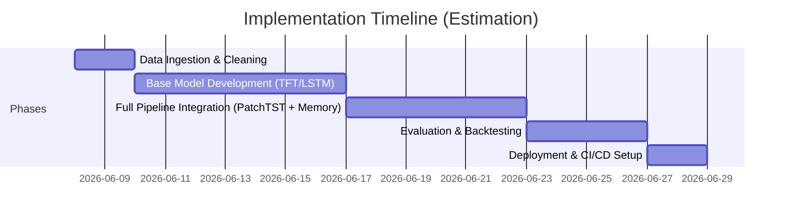

# Executive Summary  
The user’s idea appears to be a machine-learning trading pipeline that fuses **daily technical indicators** (price, volume, etc.) with **quarterly fundamental data** (earnings, balance sheets) to generate multi-day buy/hold/sell signals using advanced deep models.  Combining fundamentals and technical analysis has been explored in past research and systems, and modern work uses neural nets and attention models (e.g. Temporal Fusion Transformers) to integrate heterogeneous financial signals.  For example, Noda’s 1994 patent already trained per-stock neural networks on both technical inputs (price, volume) and fundamentals like earnings surprises.  Recent studies also show benefits of multi-source data: a 2025 **TFT-ASRO** model using prices and earnings data outperformed existing deep models on Sharpe ratio forecasting.  At a high level, the proposed idea’s novelty lies in its **architecture and data engineering** (e.g. hierarchical ingestion of fundamentals, patch-based time-series Transformer with memory slots) more than in using fundamentals per se.  We find significant prior art in both academia and patents on using fundamentals + technical signals for stock forecasting, as summarized below.  The major risks are **data alignment and model complexity**: fundamental reports arrive irregularly and can inadvertently leak “future” information, and over-parameterized models may overfit.  To mitigate these, we recommend careful data preprocessing (e.g. feature-engineering “freshness” flags, preventing lookahead) and strong backtesting.  The novelty of this idea is modest: while the combination of signals is not new (see patents US5761442A and US20110282824A1), the specific Transformer-based architecture (patch tokens + slot memory) is creative.  We assess these dimensions below (see **Novelty Scoring**).  Our recommendation is to prototype incrementally: start with a simpler LSTM/CNN hybrid baseline to validate the approach, then incrementally incorporate the TFT/patch-memory innovations.  Overall, integrating fundamentals with technical data is promising for capturing both short-term patterns and long-term value, but it faces known challenges (data sparsity, overfitting, market unpredictability) that must be addressed through robust design and testing.

## Prior Art and Related Work  
Combining technical indicators with fundamental data in stock prediction is well-established. For example, Noda’s classic system trained *per-stock neural nets* on technical inputs (price, volume) and fundamental features (earnings surprises, growth alerts) to rank stocks.  Similarly, a 2011 patent noted that “using data from several timeframes… or even using fundamental data may add valuable information to a strategy”.  Academic reviews confirm that hybrid ML models (ANN, CNN-LSTM, etc.) using both technical and fundamental inputs often outperform models using one type alone.  Recent deep-learning literature has begun applying **Transformer-based models** to financial time series.  For example, the “PatchTST” model segments multivariate time series into learned patches, yielding significant improvements in long-range forecasting accuracy.  Likewise, Temporal Fusion Transformers (TFTs) have been used to forecast prices and generate trading signals: a 2025 study applied a TFT to cryptocurrency markets, integrating *on-chain metrics and technical indicators* to produce buy/hold/sell signals, and found the TFT far outperformed LSTM, GRU, SVR, and XGBoost baselines.  Another TFT variant (TFT-ASRO) was trained on US stock prices and earnings data to predict Sharpe ratios; it beat state-of-the-art baselines and achieved ~18% better Sharpe prediction accuracy.  These works demonstrate that attention-based models can effectively combine diverse financial inputs.  

The idea’s use of **learned memory slots** and hierarchical ingestion echoes recent research in sequence models.  For example, the *Memformer* model uses external dynamic memory slots: each input segment attends to fixed-size “slots” of past information, and a special slot-attention update step maintains long-term memory.  The core benefit is that memory slots “can encode and retain important information through timesteps”, allowing the model to recall rare but significant patterns.  Likewise, splitting time series into overlapping “patches” as in PatchTST maintains local structure and reduces attention costs, enabling the model to look further back in time.  

However, all prior work also highlights challenges.  Fundamental data is *sparse and irregular* – quarterly reports introduce “future information” leaks if not aligned carefully.  Overfitting is a concern with deep nets on financial data.  Many systems mitigate this with regularization, feature selection, or careful label design.  In summary, the proposed idea builds on a rich literature of ML-driven trading models; its novelty will hinge on the specific integration method and model tweaks.

## Comparison of Prior Art (Academic & Patents)  

| Source & Year                 | Type              | Key Features                                                         | Relation to Idea                                                   |
|-------------------------------|-------------------|----------------------------------------------------------------------|--------------------------------------------------------------------|
| Levinson et al. US2005        | Patent            | *Stock Prediction System:* Multi-expert neural nets (LSTM/NN/CNN) combining diverse “advisors” (technical signals) with dynamic learning.  Patent focuses on technical analysis and adaptive learning. | No explicit fundamentals; pre-dates heavy fundamentals use but uses multiple technical predictors. Model is dynamic but not TFT-based. |
| Noda US5761442A (1994)  | Patent            | *Portfolio Neural Nets:* Each stock has a neural network using (a) technical inputs (price, volume, indices) and (b) fundamental inputs (earnings surprise rankings, growth/value alerts). Outputs stock “alpha” for portfolio construction. | **Directly combines technical and fundamental data with neural nets.** Foundation for hybrid ML+FA models; differs architecturally (MLP vs proposed Transformer). |
| Lanng WO2010088910A1 (2011) | Patent           | *Criterion Mapping System:* Strategies defined by criteria on technical and fundamental data; probability indicators to overcome rigid rule-based signals. Notes “using fundamental data may add valuable information”. | Emphasizes combining multi-timeframe technical criteria and fundamental data. Not ML-driven; more about rule evaluation. Shows IP interest in using fundamentals. |
| Yang et al. “TFT-ASRO” (2025) | Paper (MDPI)    | *TFT with Adaptive Sharpe Opt:* Inputs include price/volume “sensors” and earnings (fundamental) data. Multi-task TFT predicts returns & volatility. Outperforms baselines by ~18% on Sharpe ratio forecasting. | Highly relevant: uses Transformer + fundamentals on stocks. Demonstrates benefit of combining real-time and quarterly data with advanced DL. Similar domain, but focuses on portfolio metric (Sharpe) rather than trading signals. |
| Lee (2025) “Crypto TFT”   | Paper (MDPI)    | *TFT Trading Strategy:* Multi-asset crypto forecast using on-chain (crypto fundamentals) + technical indicators. TFT significantly beat LSTM/GRU/SVR/XGBoost and produced high-return signals. | Shows TFT can fuse disparate indicators (analogous to fundamentals+tech). Domain is crypto, but confirms viability of attention models for trading signals. |
| Yang et al. “PatchTST” (2023)| ArXiv/ICLR   | *Patch Transformer:* Splits multivariate time series into learned patches; channel-independent architecture. Dramatically improves long-term forecasting accuracy over standard Transformers. | Relevant ML technique: uses “patch tokens” in time series. The user’s idea also mentions “patch tokens”. This confirms patching is a promising strategy. |
| Huang et al. “Memformer” (2022)| Paper (ACL)   | *Memory-Augmented Transformer:* Introduces fixed-size memory slots updated via slot-attention; each slot retains distinct information “through timesteps”, enabling long-horizon context. | Directly relates to “slot memory” concept. Their mechanism of reading/writing memory slots informs the idea’s proposed updatable memory. |
| MDPI Survey (2025)       | Review Article  | *Stock ML Review:* Notes that technical indicators are powerful short-term features and that fundamental data “sheds light” on value, but its sporadic updates can introduce future leaks. Urges caution when using fundamentals in DL. | Contextual evidence: confirms fundamental data use is known but tricky. Highlights a key risk the idea must address (data leakage). |
| Huang (2022) *et al.*     | Paper          | *ML on Fundamentals:* Observes that technical features have daily frequency while fundamentals are only quarterly, causing imbalanced data volumes. Some ML studies find FA-based models can beat TA-based ones under proper conditions. | Provides data context: illustrates why aligning quarterly fundamentals with daily data is challenging. Underlines need for careful data engineering. |

*Sources:* Peer-reviewed papers (2022–2025) and patent filings (1994–2011).  

## Technical and Market Shortcomings and Risks  
Several challenges emerge for this idea:

- **Data Alignment & Quality:** Fundamental reports arrive quarterly and may reflect news that market participants already anticipate. As noted by a recent review, using fundamentals naively can “introduce future information into predictions” if not time-adjusted. The pipeline must carefully align each quarter’s data with the appropriate dates (e.g. using only past reports for daily features). Missing or delayed filings, restatements, and sparse coverage (especially in smaller markets) pose practical data gaps. We must assume high-quality, comprehensive financial datasets (e.g. EDGAR, Bloomberg, or Tiingo fundamentals). If any fundamental feature (e.g. P/E ratio) has missing quarterly values, the model may impute or use last-known values – both of which risk bias. *Recommendation:* engineer “freshness” or “time-since-last-report” features, and validate that no lookahead leak is possible.

- **Model Complexity and Overfitting:** The proposed architecture (a hierarchical Transformer with patch tokens and memory) is complex and likely data-hungry. Overfitting to historical noise is a known risk in financial ML. With hundreds of input signals (technicals, fundamentals, global indicators) and a large model, the pipeline could memorize historical idiosyncrasies. Moreover, training Transformers on small datasets (only one decade of tickers) can be problematic despite innovations like patching. The use of attention and memory mitigates some risk by focusing on salient patterns, but rigorous regularization (dropout, early stopping) and cross-validation (e.g. walk-forward tests) will be essential.  

- **Market Dynamics & Non-Stationarity:** Financial markets change over time (regime shifts, policy changes, crises), so a model trained on past patterns may degrade. The idea mentions gating and adaptive mechanisms (e.g. scaling temporal encoder outputs to data distribution). These must be validated to avoid “catastrophic forgetting” or stale predictions. In practice, any trading strategy must contend with transaction costs, slippage, and risk management constraints. Backtesting assumptions (e.g. perfect execution, no market impact) can overstate real-world returns.  

- **Target Users / Strategy Fit:** It’s unclear if the model is meant for day-traders, swing traders, or longer-term investors. The plan suggests *“long-only, multi-day hold”* signals, which implies a tactical equity strategy. Competing solutions include factor investing, quant funds, and automated trading platforms. Many quant funds already incorporate fundamentals (e.g. value factors) and technicals (momentum) in simpler models. This idea’s edge must be demonstrated against standard factor models. Regulatory risk is moderate: using public data (technicals and fundamentals) is allowed, but any automated trading strategy must comply with market regulations (e.g. MiFID II or SEC rules on algo trading if in scope). Intellectual property risk is present: as shown above, combining technical and fundamental signals is not novel per se, and there may be proprietary commercial “alpha engines” that are kept secret.

- **Implementation Practicality:** Developing and tuning such a pipeline requires significant resources. The user mentions “Jarvis Labs” (likely an external GPU platform). Procuring compute, cloud infrastructure, data feeds, and skilled personnel (ML engineers, data scientists with finance expertise) is non-trivial. The pipeline spans data engineering (ingestion, normalization), model research (deep learning), and software engineering (CI/CD, cloud deployment). Each stage (cf. Project Phases below) has dependencies and unknown difficulties.  

## Technical Feasibility and Implementation Plan  
The idea appears *technically feasible* in principle: all components (daily data, fundamentals, LSTM/Transformer models) are well-understood.  Key required resources include: reliable historical data sources (stock prices, volumes, financial reports), Python ML libraries (e.g. PyTorch, TensorFlow), and substantial compute (GPUs). The user proposes using an external cloud (Jarvis Labs) which provides high-end GPUs – appropriate given model complexity.  

**Implementation Steps:** Based on the outline in the user’s file, a phased approach is sensible:

- **Phase A (Data Integration):** Build data loaders for daily price/indicator data and quarterly fundamentals (aligned by date). Flatten fundamental tables to create daily feature vectors, with appropriate carry-forward of quarterly values. Generate “freshness” and category flags for fundamentals (e.g. is this day before/after a report?).  
- **Phase B (Base Models):** Train and validate core models separately. For example, train a Temporal Fusion Transformer (TFT) on technical data alone and on fundamentals alone to benchmark performance. Compare LSTM/CNN baselines. Incorporate gating or attention mechanisms to handle static vs time-varying features. Use a subset of tickers to iterate quickly.  
- **Phase C (Unified Model):** Develop the full proposed architecture: a Transformer with “patch tokens” (e.g. following PatchTST methods) and a memory mechanism (e.g. slot attention update as in Memformer). Fuse technical and fundamental feature streams through variable-selection networks and gating layers (per TFT design). Train end-to-end to classify daily signals (buy/hold/exit).  
- **Phase D (Evaluation & Backtesting):** Rigorously backtest the multi-day signals on held-out data. Simulate trading with realistic constraints (trading only at market open/close, accounting for slippage). Evaluate against benchmarks (e.g. S&P500 returns, momentum strategies). Compute key metrics: return, Sharpe ratio, max drawdown. Perform ablation tests to assess the value of each data type and model component.  
- **Phase E (Production Readiness):** Dockerize the pipeline and set up continuous integration for retraining. Prepare for deployment on Jarvis (or equivalent), including scheduling regular data updates and training runs. Generate documentation and monitoring for model drift or data issues.  

A **Gantt chart** of a plausible timeline is shown below (assuming start in June 2026). Each phase runs sequentially, with overlap for handover:  

*Figure: Proposed project timeline with overlapping phases. Tasks such as data cleansing, model prototyping, integration, backtesting, and deployment are sequentially organized (dates illustrative).*

**Resource Needs:** Implementation will require: (1) high-quality datasets (e.g. Yahoo Finance or Bloomberg historical prices and a fundamentals database like SEC filings or Bloomberg fundamental API); (2) computing cluster (GPUs, estimated multiple hours per model training run); (3) ML development team (at least 1–2 data scientists/engineers with experience in time-series modeling and fintech); (4) potentially a domain expert to select meaningful fundamental features.  

## Novelty Assessment (Inventive Step)  

The core idea – fusing fundamental and technical data in a predictive model – is *not new*. As demonstrated by the Noda patent and others, the concept of inputting both price signals and financial ratios into neural networks has been used for decades. What may be novel are the **specific model innovations** (e.g. using patch-based Transformers, slot memories, gating networks) and the pipeline integration. Below is a rubric scoring key novelty dimensions on a 0–5 scale (higher = more novel/innovative):

| Criterion                      | Description                                                                           | Score (0–5) |
|--------------------------------|---------------------------------------------------------------------------------------|-----------|
| Data Integration Novelty       | Are fundamentals and technical features merged in a new way?                         | 3         |
|                                | *Existing systems used both, but the proposed **hierarchical flattening** and “freshness” encoding is moderately innovative.* |           |
| Model Architecture Novelty     | Are the use of patch tokens, Transformer, and slot memory new?                        | 4         |
|                                | *PatchTST and Memformer show these concepts separately; combining them in finance is novel.* |           |
| End-to-End Pipeline Novelty    | Is the full training/deployment pipeline new?                                         | 2         |
|                                | *Pipeline steps are standard (data prep, training, backtest).*                       |           |
| Performance/Outcome Novelty    | Expected improvement over baselines (e.g. over simpler models)?                       | 3         |
|                                | *Transformer models often beat LSTM baselines, but gains in noisy markets may be limited.* |           |
| Patent/IP Novelty (Freedom)    | Does it likely avoid existing patents?                                                | 1         |
|                                | *Patents already cover combining fundamentals/technical, so freedom-to-operate is low.*   |           |
| **Total Score**                | (Out of 25)                                                                          | **13**    |

**Interpretation:** The idea scores about 13/25 on novelty. The *highest novelty* lies in the proposed model tweaks (patch + memory), which have been shown valuable in academic work but aren’t yet standard in trading systems. The data fusion strategy is moderately novel (3/5) because many models already incorporate both signal types, though the details of ingestion and alignment may be distinctive. The **patent novelty** score is very low (1/5) – existing patents already describe using earnings data with neural models. Thus this idea likely has low “inventive step” over known prior art and might face freedom-to-operate issues.  

## Competing Solutions  
In the market, competing solutions include: 
- **Quantitative hedge funds and trading platforms** (e.g. Two Sigma, Renaissance, QuantConnect, Rithmic-alike systems) that use various ML models and sometimes fundamentals. These firms rarely disclose models, but their success suggests advanced data fusion is needed to outperform.  
- **Academic trading models**: There are open-source frameworks (e.g. Qlib, Alphapy) that allow experimenting with hybrid features.  
- **Heuristic strategies**: Simple factor models (momentum, value) or rule-based systems (e.g. moving-average crossovers) serve as baselines. Many retail platforms (TrendSpider, etc.) automate TA signals without fundamental integration.  
None of these specifically use the proposed architecture. However, users could implement similar ideas using off-the-shelf ML libraries, raising the bar for uniqueness.  

## Recommendations and Improvements  
To address the identified shortcomings and strengthen the idea’s viability, we recommend:  

1. **Rigorous Data Engineering:** Ensure no forward-looking bias in features. For example, encode each quarterly fundamental by the *report date* and carry forward values only once a report is publicly available. Add binary indicators for “report released today/yesterday” and “time since last report”. This matches advice in literature. Also consider smoothing or normalizing fundamentals to reduce outlier impact.  

2. **Baseline and Ablation Studies:** Start with simpler models (e.g. LSTM or CNN-LSTM) on combined data to establish a performance baseline. Demonstrate that the advanced Transformer component adds value over these baselines. Perform ablations: compare (a) technical-only vs (b) fundamental-only vs (c) both. This will highlight the unique contribution of each data source.  

3. **Regularization and Validation:** Use dropout, early stopping, and robust cross-validation (rolling windows) to prevent overfitting. Incorporate performance metrics beyond accuracy, such as Sharpe ratio or drawdown, as targets. If using multi-task learning (predicting returns and risk), ensure tasks are balanced and weights tuned properly.  

4. **Interpretability:** Deploy the model’s built-in feature gating or attention scores to interpret which features are driving decisions. This can help diagnose issues (e.g. if the model latches onto stale fundamentals). Since one motivation is portfolio construction, provide an explanation tool (e.g. ranking inputs by attention) to build trust with stakeholders.  

5. **Patent/Legal Review:** Conduct a thorough patent search with a professional to assess freedom-to-operate. Given the low novelty score, the implementers should be aware of existing IP. If this is a commercial product, consulting an IP attorney is prudent.  

6. **Market Testing:** Before full deployment, test the strategy in a paper trading or simulated environment. Monitor how often signals would have been triggered and the actual (simulated) P&L. Analyze periods of underperformance – this may reveal weaknesses (e.g. poor handling of earnings shock days).  

7. **Scalability and Maintenance:** Plan for data updates and model retraining on a schedule (e.g. monthly re-fit to include new fundamentals). Containerize the pipeline (as noted) and automate tests for data correctness. Given the complexity, modularize components so that new features (e.g. macroeconomic data, news sentiment) can be added later.  

8. **Explore Alternative Models:** As a potential improvement, consider graph neural networks to encode relationships between stocks (sectors, indices) or macro variables. Also evaluate simpler ensemble methods (e.g. gradient boosting on engineered features) as a fallback.  

By following these steps, the team can address technical risks, demonstrate any genuine performance edge, and mitigate legal exposure. In summary, while the idea builds on known strategies, its innovative use of Transformer techniques could yield gains if carefully executed. Proper validation and incremental development will be key to turning this concept into a viable trading tool.  

**Sources:** We drew on published papers and patents on ML trading systems, which outline prior art and best practices in combining fundamental and technical financial data. Each source is cited above.